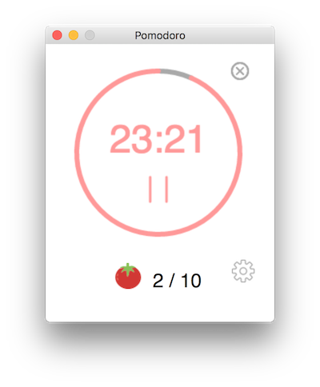
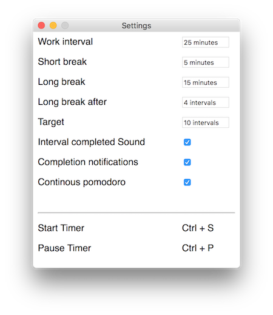

While learning JS, trying to recreate the 'Be Focus' App on Mac, You can place all the files with `nw.js`. 

Then you can run it as an App! ✌️ An App!

Main Screen:

Setting Screen:

Next:

- save log data
- clean the code or (redesign the UI/code)

